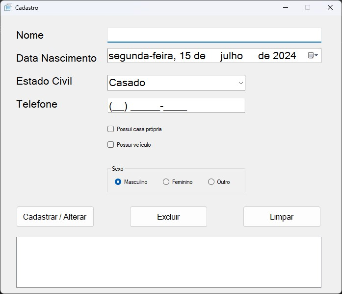

# 🖥️ Sistema de cadastro para Desktop 

## ℹ️ Sobre

Este projeto é uma `aplicação desktop` desenvolvida em `C#` e `.NET Framework` que permite o **cadastro**, **listagem**, **edição** e **exclusão** de registros de pessoas - todos os dados são persistidos em memória. 

## 🚀 Funcionalidades

- **Cadastro de Pessoas**: Permite cadastrar uma nova pessoa preenchendo os campos de nome, data de nascimento, estado civil, telefone, posse de casa e veículo, e sexo.
- **Listagem de Pessoas**: Exibe uma lista com todos os registros cadastrados, mostrando nome e telefone.
- **Edição de Registro**: Permite editar um registro existente ao clicar duas vezes sobre o item na lista.
- **Exclusão de Registro**: Permite excluir um registro selecionado da lista.
- **Limpeza de Campos**: Possibilita limpar todos os campos do formulário para um novo cadastro.


## 🔥 Como Executar o Projeto

### Pré-requisitos
- Visual Studio 2019 ou superior
- .NET Framework 4.7.2 ou superior

#### Passo a Passo
1. **Clonar o Repositório**:

Clone o repositório para sua máquina local usando o comando:

```bash
git clone https://github.com/giovanesouza/sistema-de-cadastro-desktop
```

2. **Abrir o Projeto no Visual Studio**:

- Abra o Visual Studio.
- Navegue até Arquivo -> Abrir -> Projeto/Solução.
- Selecione o arquivo .sln localizado na pasta do projeto clonado.

<!-- 
3. Restaurar Dependências:

- No Visual Studio, abra o Gerenciador de Soluções.
- Clique com o botão direito na solução e selecione Restaurar Pacotes NuGet. 
-->

3. **Compilar o Projeto**:
- No menu superior, selecione Compilar -> Compilar Solução ou pressione Ctrl+Shift+B.


4. **Executar a Aplicação**:

- No menu superior, clique em Depurar -> Iniciar sem Depuração ou pressione Ctrl+F5.
Interface do Usuário

#### Campos de Entrada:

- **Nome**: `Campo de texto` para inserir o nome da pessoa.
- **Data de Nascimento**: `Campo de texto` para inserir a data de nascimento.
- **Estado Civil**: `ComboBox` com as opções Casado, Solteiro, Viúvo e Separado.
- **Telefone**: `Campo de texto`para inserir o telefone.
- **Possui Casa**: Checkbox para indicar se a pessoa possui casa própria.
- **Possui Veículo**: `Checkbox` para indicar se a pessoa possui veículo.
- **Sexo**: `Radio buttons` para selecionar o sexo (Masculino, Feminino ou Outro).

#### Botões:

- **Cadastrar**: Adiciona ou atualiza um registro de pessoa.
- **Excluir**: Remove o registro selecionado da lista.
- **Limpar**: Limpa todos os campos do formulário.

#### Lista de Registros:

- Exibe os registros cadastrados com nome e telefone.
- Permite a edição ao clicar duas vezes sobre um item da lista.


## 📝 Estrutura do Código

### Classes Principais

- **Form1**: Classe principal que contém toda a lógica da aplicação.
- **Pessoa**: Classe que representa o modelo de dados para uma pessoa.

### Métodos Principais

- **btnCadastrar_Click**: Método que trata o evento de clique no botão Cadastrar. Adiciona ou atualiza um registro na lista de pessoas.
- **btnExcluir_Click**: Método que trata o evento de clique no botão Excluir. Remove o registro selecionado da lista.
- **btnLimpar_Click**: Método que trata o evento de clique no botão Limpar. Limpa todos os campos do formulário.
- **Listar**: Método que atualiza a lista de registros exibida na interface.
- **lista_MouseDoubleClick**: Método que trata o evento de duplo clique em um item da lista, permitindo a edição do registro.


## ✅ Resultados obtidos

### Tela sem inserções


### Verificação de preenchimento (Campo obrigatório)
")

### Cadastro realizado com sucesso (exibição na lista)
")

### Edição de registro

